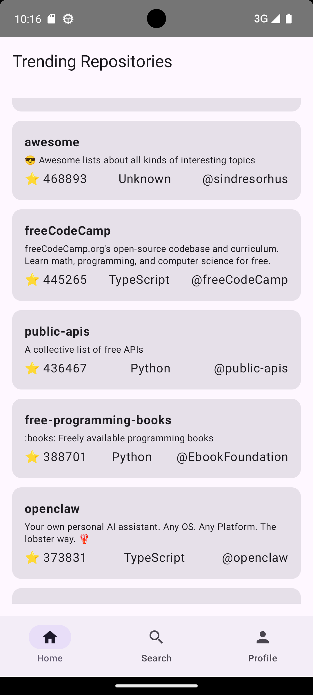
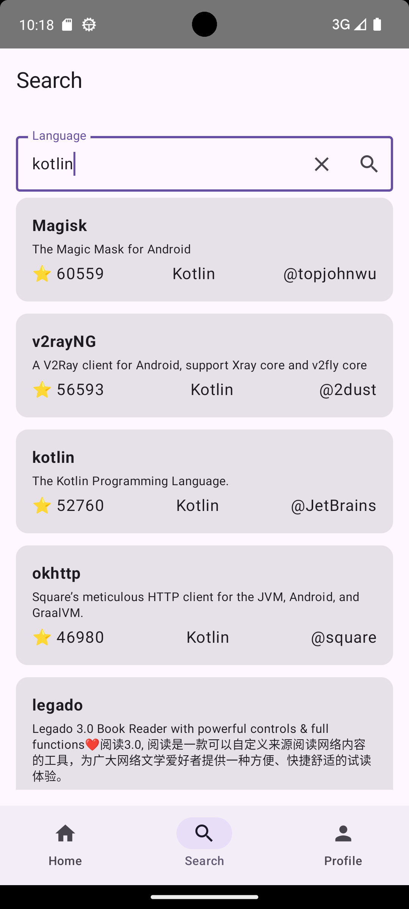
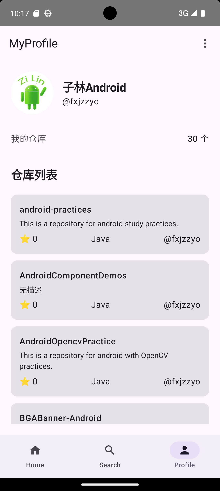
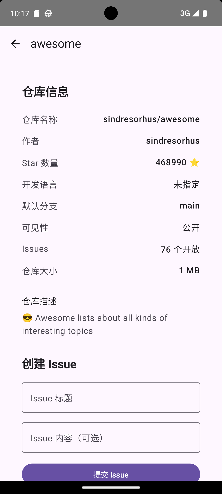
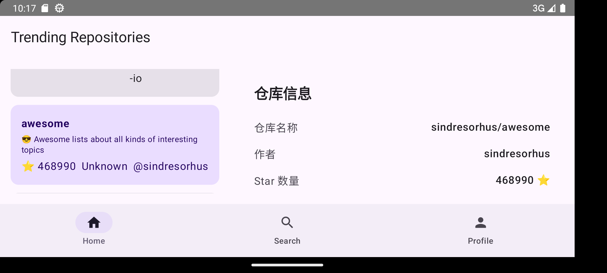
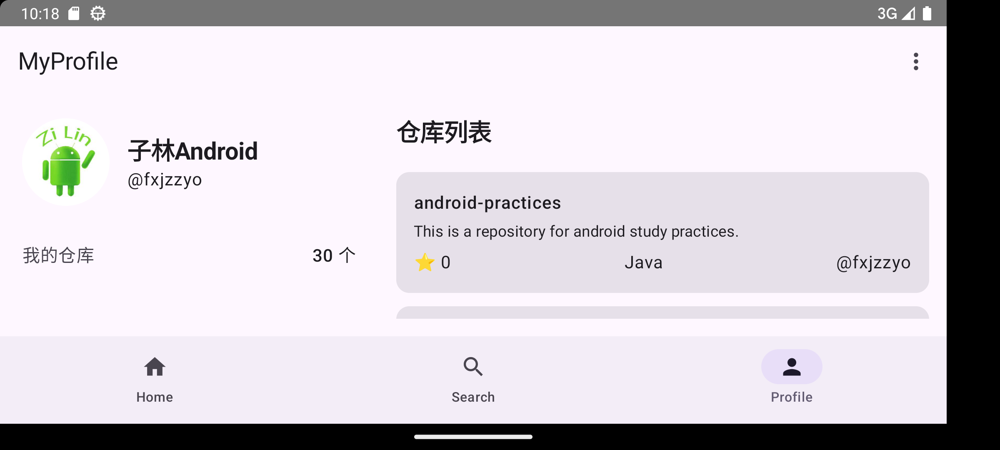

# GitHub Android Client
**中文 | [English](README.EN.md)**

---

## 项目介绍
本项目是一款基于 Jetpack Compose 开发的 Github 第三方客户端，采用现代化的 MVVM 架构，结合 Retrofit 网络请求、DataStore 持久化存储，实现 Github 开源仓库浏览、搜索、用户个人中心、Issue 创建、用户登录等核心功能。
项目严格遵循 Android 最新开发规范，封装了完整的网络异常处理机制，支持网络超时、断网、服务异常等场景的错误提示与重试功能，页面状态统一管理（Loading、错误、空数据、正常数据）。

## ✨ 项目功能
- 热门仓库浏览：查看 GitHub trending 开源仓库列表
- 语言检索仓库：依据编程语言筛选对应仓库资源
- 仓库详情查看：展示仓库基础信息、星标数、分支、大小等数据
- 页面路由跳转：仓库条目点击可进入详情页面
- GitHub 账号登录：通过个人 AccessToken 完成身份校验登录
- 个人资料展示：登录后查看自身账号信息与名下仓库
- Issue 提交操作：登录账号可向仓库新建提交问题工单
- 账号退出登录：一键注销登录状态，清空本地凭证
- 网络异常处理：适配断网、超时、请求失败场景，支持点击重试
- 多状态页面：加载中、错误提示、空数据、正常展示四种界面状态
- 兼容横屏模式：横屏下左侧列表，右侧详情页

## 🛠 技术栈
- UI：Jetpack Compose (Material3)
- 架构：MVVM，ViewModel,LiveData
- 网络：Retrofit2 + OkHttp3
- 异步：Kotlin Coroutine + Flow
- 数据存储：DataStore
- 图片加载：Coil
- 导航：Jetpack Navigation

## 📦 构建教程
1. 环境要求
- Android Studio Hedgehog / Iguana 及以上
- Kotlin 1.9+
- Android Gradle Plugin 8.0+
- MinSdk 29
2. 克隆项目git clone https://github.com/fxjzzyo/GithubClientApp.git
3. 打开项目：使用 Android Studio 打开根目录，等待 Gradle 同步完成
4. 配置网络：项目已内置 GitHub 官方 Api 地址，无需额外配置
5. 编译项目：点击菜单栏 `Build -> Make Project` 完成构建

## ▶️ 运行项目
1. 连接安卓真机或启动模拟器
2. 在 Android Studio 顶部选择运行配置 app
3. 点击绿色运行按钮（Shift+F10）
4. APP 自动安装并启动
5. 也可以直接使用安装包(app/release/app-release.apk)进行测试

使用说明：
- 首页：浏览 Github 热门开源仓库
- 搜索页：根据编程语言搜索对应仓库
- 详情页：查看仓库详情、提交 Issue（需登录）
- 个人中心：未登录展示登录引导，已登录展示用户信息与个人仓库

## 🧪 测试说明
- 登录状态测试：未登录进入个人中心展示登录引导；使用 Github 个人 AccessToken 登录后正常展示用户数据
- 页面状态测试：Loading、错误、空数据、正常数据四种状态切换正常
- 跳转测试：首页/搜索/个人仓库 Item 均可正常跳转详情页
- 退出登录测试：退出后清空本地数据，返回首页，个人中心重置为未登录状态
- 网络异常测试：关闭网络，所有页面自动展示错误提示 + 重试按钮
- 视频演示: [/video/视频演示.mp4](/video/GithubClient视频演示.mp4)

## 效果演示

- 视频演示

[点击观看演示视频](https://github.com/fxjzzyo/GithubClientApp/video/video.html)

[项目演示视频](https://github.com/fxjzzyo/GithubClientApp/raw/main/video/GithubClient视频演示.mp4)

- 竖屏

  
  
  

  

- 横屏

  
  

 
